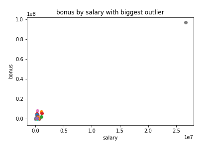
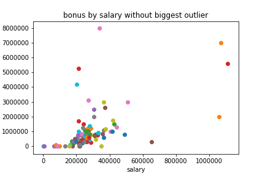
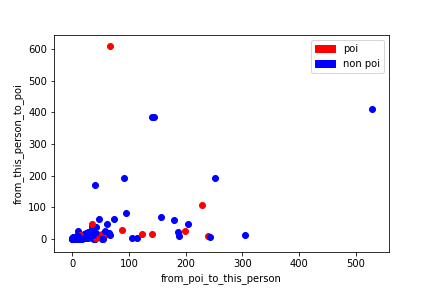
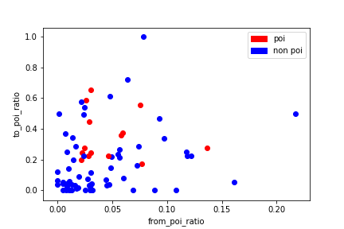

# 从安然公司邮件中发现欺诈证据

## 项目背景

安然曾是 2000 年美国最大的公司之一。在2001年宣告破产之前，安然拥有约21000名雇员，是世界上最大的电力、天然气以及电讯公司之一，2000年披露的营业额达1010亿美元之巨。2002 年，由于其存在大量的企业欺诈行为，这个昔日的大集团土崩瓦解。 在随后联邦进行的调查过程中，大量有代表性的保密信息进入了公众的视线，包括成千上万涉及高管的邮件和详细的财务数据。

## 目标

本项目中， 我的主要目标是根据公开的安然财务和电子邮件数据集，构建自己的算法，找出有欺诈嫌疑的安然员工，将学到的机器学习技巧付诸实践。

本项目提供了可读入数据的初始代码，可以将我选择的特征放入 numpy 数组中，该数组是大多数 sklearn 函数假定的输入表单。 我要做的就是设计特征，选择并调整算法，用以测试和评估识别符。

## 理解数据集和问题

### 数据探索

- 数据总点数

本数据集的总点数为146，即146人。

- 数据中的特征和标签

数据中的特征分为三大类，即财务特征、邮件特征和 POI 标签。根据程序统计得， 总共有20个特征。

财务特征: ['salary', 'deferral_payments', 'total_payments', 'loan_advances', 'bonus', 'restricted_stock_deferred', 'deferred_income', 'total_stock_value', 'expenses', 'exercised_stock_options', 'other', 'long_term_incentive', 'restricted_stock', 'director_fees'] (单位均是美元）

邮件特征: ['to_messages', 'email_address', 'from_poi_to_this_person', 'from_messages', 'from_this_person_to_poi', 'shared_receipt_with_poi'] (单位通常是电子邮件的数量，明显的例外是 ‘email_address’，这是一个字符串）

POI 标签: [‘poi’] (boolean，整数)

打印任意一个人的姓名、特征和标签作为参考：

``` python
('OLSON CINDY K', {'salary': 329078, 'to_messages': 1184, 'deferral_payments': 77716, 'total_payments': 1321557, 'exercised_stock_options': 1637034, 'bonus': 750000, 'restricted_stock': 969729, 'shared_receipt_with_poi': 856, 'restricted_stock_deferred': 'NaN', 'total_stock_value': 2606763, 'expenses': 63791, 'loan_advances': 'NaN', 'from_messages': 52, 'other': 972, 'from_this_person_to_poi': 15, 'poi': False, 'director_fees': 'NaN', 'deferred_income': 'NaN', 'long_term_incentive': 100000, 'email_address': 'cindy.olson@enron.com', 'from_poi_to_this_person': 20})
```

- 类之间的分配（ POI / 非 POI ）

POI 为”Person of Interest“嫌疑犯的缩写。如果“POI”是1说明此人为嫌疑人，“POI”是0说明此人不是嫌疑人。统计可得安然数据集中POI的总人数为18， 非POI的总人数为128。

- 具有缺失值的特征

对于数据集中的所有人，不是每一个特征都有值。当特征没有明确的值时，我们使用NaN表示它。统计可知出 POI 标签外，其他特征都有缺失值。缺失值个数超过100的有:deferral_payments ( 107个 )、restricted_stock_deferred ( 128个 )、loan_advances ( 142个 )、director_fees( 129个 ) 。在 POI 标识符中不应该使用这些特征，因为它们的缺失值太多，可供机器学习算法训练的的样本点太少。

### 异常值调查

在分析财务数据salary和bounds之间的关系时发现了一个极为异常额异常值，如下图所示:



明显在右上角有一个极为异常的点，奖金和薪水远远高于其他人。于是，我查找出这个异常点对应的人名, 为TOTAL。很明显这不是一个人名，应该是电子表格统计所得的结果，而非是一个人，对我们查找嫌疑人没有帮助，所以我决定移除这个异常点。



移除最大的异常点之后, 发现还有四个异常点。其中两人获得了至少 5 百万美元的奖金，以及超过 1 百万美元的工资。打印这两个点对应的人名为：LAY KENNETH L，SKILLING JEFFREY K。他们分别是安然公司的主席和 CEO， 他们数据的异常有利于我们查找出嫌疑人， 应该保留。

## 优化特征选择/工程

### 创建新特征

嫌疑人之间可能更加频繁地发邮件沟通，也就是说，他们相互发邮件的频率要比其他大部分给嫌疑人发送邮件的频率更高
先用散点图显示’from_this_person_to_poi’， ’from_poi_to_this_person’和’poi’标签之间的关系。



由上散点图可以看出，’from_this_person_to_poi’， ’from_poi_to_this_person’和’poi’标签之间的关系没有很强的趋势，poi和非poi的点混在一起，所以根据雇员收到嫌疑人和发送给嫌疑人的邮件数目并不能很好判断其是否为嫌疑人。因此我根据每个人'from_this_person_to_poi'，'from_poi_to_this_person'，'to_messages'， 'from_messages'的这四个特征创建了新特征，雇员收到和发送嫌疑人邮件百分比‘from_poi_ratio’，‘to_poi_ratio’，百分比值越高，该雇员与嫌疑人之间的护发邮件的频率也就越高，该雇员是嫌疑人的几率越大。



由‘from_poi_ratio’和‘to_poi_ratio’的散点图，可以看出在一大块特征空间内几乎没有一个是嫌疑人的点，比如当‘to_poi_ratio’小于0.2时，没有人是嫌疑人。如果一个人的‘to_poi_ratio’特征小于0.2，那么他很可能不是嫌疑人。这个模式有助于机器学习算法得到更好的表现。利用tester.py在加入新特征和没有加入新特征两种情况下对最终选择的朴素贝叶斯算法做了测试，在没有加入新特征时算法的最佳表现为Precision: 0.50312	Recall: 0.32300， 加入新特征时算法最佳表现为Precision: 0.51572	Recall: 0.38550。加入新特征对算法的表现有所提高。

### 明智地选择特征

首先移除缺失值个数超过100的4个特征， 再用特征‘from_poi_ratio’，‘to_poi_ratio’替代'from_this_person_to_poi'，'from_poi_to_this_person'，'to_messages'， 'from_messages'的这四个特征，因为特征‘from_poi_ratio’和‘to_poi_ratio’更准确表现了'from_this_person_to_poi'，'from_poi_to_this_person'，'to_messages'， 'from_messages'中的信息。特征‘email_address'为邮箱地址，无法给我们判断嫌疑人提供有用的信息，所以应该移除。
这样初步选出了13个特征，它们为：'salary', 'total_payments',
                      'exercised_stock_options', 'bonus', 'restricted_stock',
                      'deferred_income', 'total_stock_value', 'expenses',
                      'other', 'long_term_incentive', 'shared_receipt_with_poi',
                      'to_poi_ratio', 'from_poi_ratio'。
利用SlectKBest选择不同的特征的个数，再用tester.py测试不同特征个数对朴素贝叶斯和决策树算法性能的影响，并记录在如下表格中。

朴素贝叶斯：

| 特征数量 | Precision | Recall  | F1      | F2      |
|----------|-----------|---------|---------|---------|
| 1        | 0.46055   | 0.32100 | 0.37831 | 0.34171 |
| 2        | 0.46889   | 0.26750 | 0.34066 | 0.29264 |
| 3        | 0.48581   | 0.35100 | 0.40755 | 0.37163 |
| 4        | 0.50312   | 0.32300 | 0.39342 | 0.34791 |
| 5        | 0.49545   | 0.32650 | 0.39361 | 0.35040 |
| 6        | 0.51572   | 0.38550 | 0.44120 | 0.40600 |
| 7        | 0.48716   | 0.37950 | 0.42664 | 0.39705 |
| 8        | 0.48617   | 0.39550 | 0.43617 | 0.41082 |
| 9        | 0.40446   | 0.31750 | 0.35574 | 0.33177 |

决策树：

| 特征数量 | Precision | Recall  | F1      | F2      |
|----------|-----------|---------|---------|---------|
| 1 | 0.54787	| 0.30900 | 0.39514 | 0.33852
| 2 | 0.34909 | 0.22900 | 0.27657 | 0.24592
| 3 | 0.25806 | 0.06800 | 0.10764 | 0.07975
| 4 | 0.26411 | 0.06550 | 0.10497 | 0.07710
| 5 | 0.15466 | 0.03650 | 0.05906 | 0.04308
| 6 | 0.12806 | 0.03400 | 0.05373 | 0.03985
| 7 | 0.12357 | 0.03250 | 0.05146 | 0.03812
| 8 | 0.12618 | 0.03350 | 0.05294 | 0.03927
| 9 | 0.12630 | 0.03650 | 0.05663 | 0.04255

由表格可以看出当特征数为6时朴素贝叶斯算法的性能最好，且随着特征数量的增加，朴素贝叶斯算法的性能先增加后减少。当特征数为1时决策树算法的性能最好，且随着特征数量的增加其性能在下降。综合比较朴素贝叶斯算法和决策树precison和Recall两个指标，朴素贝叶斯算法最佳性能略优于决策树的最佳性能。所以最后通过SelectKBest选取 6 个得分最高的特征，得分最高的6个特征及其得分如下：

```python
exercised_stock_options: 25.0975415287
total_stock_value: 24.4676540475
bonus: 21.0600017075
salary: 18.575703268
to_poi_ratio: 16.6417070705
deferred_income: 11.5955476597
```

### 特征缩放

我选用的算法为朴素贝叶斯和决策树，特征缩放对它们不产生影响，所以不要部署特征缩放。特征缩放是将每一个特征归一化，比如将取值范围处理为0到1之间，所以两个维度影响结果的算法将受到特征缩放的影响。决策树算法在进行分类时，它只是在不同方向上做切割，当处理一个维度时，如果进行缩放，它还是会按照比例进行切割， 无需考虑另一个维度的影响，所以特征缩放并不会影响决策树算法的结果。朴素贝叶斯算法是利用概率分布进行分类，所以也不会受到特征缩放的影响。

## 选择和调整算法

### 选择算法

对安然数据集中的特征的学习过程属于有监督的机器学习，所以我采用朴素贝叶斯和决策树算法进行模型的训练和预测。

### 参数调整及其重要性

同一算法如决策树，采用不用的参数数值如min_samples_split 时会得到不同的精确度和召回率，而参数调整就是要帮助我们找到适合的参数值使得算法的精确度和召回率达到最高，即是最好的评估结果。

### 算法调整

我采用了 GridSearchCV 对决策树的min_samples_split参数进行了调整，GridSearchCV 用于系统地遍历多种参数组合，通过交叉验证确定最佳效果参数。它的好处是，只需增加几行代码，就能遍历多种组合。决策树的min_samples_split参数的最佳值为：70。

## 验证和评估

### 评估度量的使用

评估采用了precision（TP/(TP+FP)）和recall（TP/(TP+FN)）两个指标，原因是本数据集嫌疑人和非嫌疑人人数差距大，数据不平衡，将人数较多的TN（true negative）排除在外的指标能更好的反映算法的性能。在本项目中, precision = TP/(TP+FP) = 预测正确的嫌疑人占总预测的嫌疑人的比例，recall = TP/(TP+FN) = 预测正确的嫌疑人占真正的嫌疑人的比例。

### 验证及其重要性

验证是机器学习比不可少的环节，我们用不同的算法对训练集建立了模型，需要用测试集进行验证，通过验证可以试出自己的算法的学习成果、算法是否过拟合，并可以知道其泛化能力。机器学习本身也是一个不断学习、验证、调整的循环过程，最终达到需要的指标（如精确度、召回率）。验证中典型的错误是没有将数据拆成训练集和测试集。无验证的机器学习容易导致过拟合。

### 验证策略

 使用 sklearn.cross_validation 中的 train_test_split 验证； 将 30% 的数据用于测试，并设置 random_state 参数为 42（random_state 控制哪些点进入训练集，哪些点用于测试；将其设置为 42 意味着我们确切地知道哪些事件在哪个集中； 并且可以检查得到的结果）。

 数据集在进行划分之前，首先是需要进行打乱操作，否则容易产生过拟合，模型泛化能力下降。StratifiedShuffleSplit函数会将数据集随机打乱，然后按照训练集和测试集的比例对数据集进行分割，不断迭代随机打乱然后分割数据集的过程，这样就产生了分割的数据集样本是随机分布的K折交叉。tester.py给出的评分会和自己得出的评分有差异的原因，是因为自己的评分的分割的结果样本的分布不是随机的且，只分割了一次，分类器会产生过拟合。

### 算法性能

在特征选择时候对朴素贝叶斯的算法和决策树算法的表现做了对比。由特征选择的两个表格可以看出特征数越多，决策树的表现越差，这时因为数据集中的样本比较小，特征数越多，决策树越容易过拟合。利用my_dataset对朴素贝叶斯的算法和决策树算法在分布选择最佳的特征个数时进行的交叉检验的结果为：
决策树的性能:
recall score: 0.4
precision score: 0.333333333333
朴素贝叶斯性能:
recall score: 0.4
precision score: 0.4
通过tester.py对两算法的评估如特征选择的两个表格所示。
通过对比，朴素贝叶斯的算法在安然数据集上表现的性能更好，故最终采用朴素贝叶斯算法。
